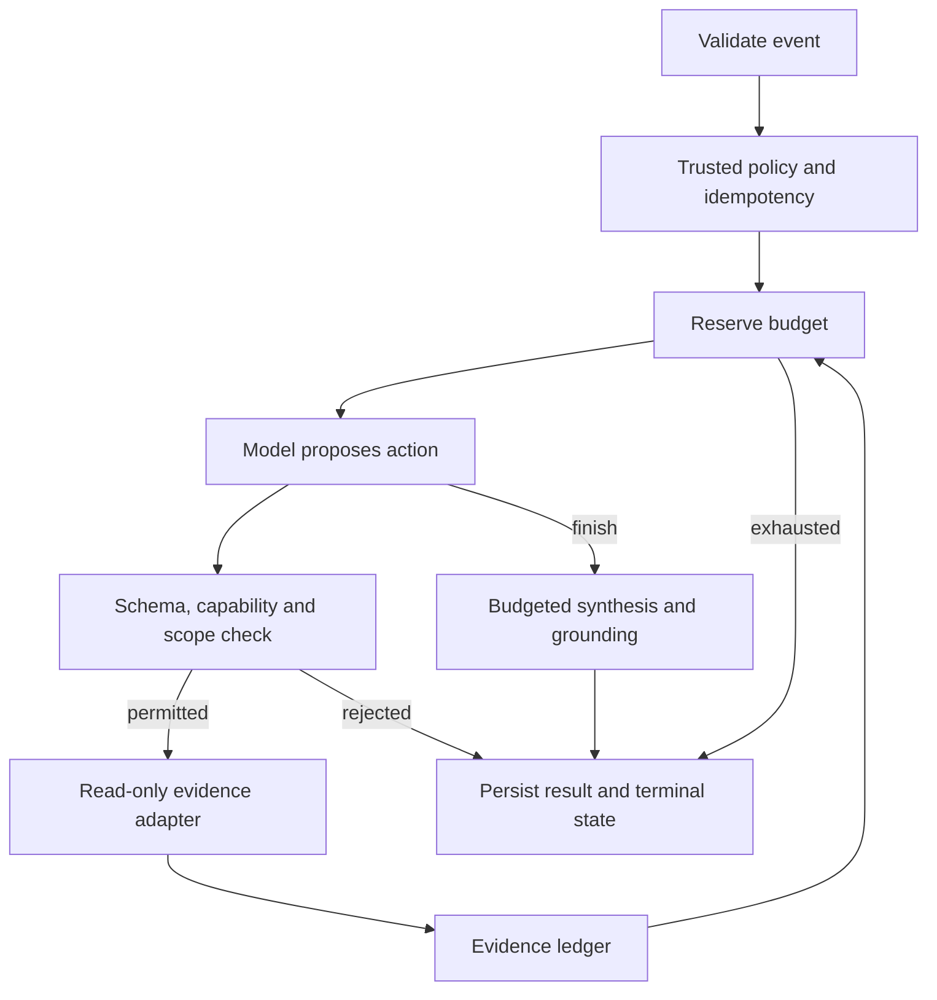

# AgenticDef

[](https://github.com/trionnemesis/AgenticDef/actions/workflows/ci.yml)
[](https://www.python.org/)
[](LICENSE)
[](docs/verification.md)

> A bounded, read-only investigation runtime for security events. The model proposes what to inspect; deterministic code controls capabilities, scope, budgets, evidence references, and termination. Missing evidence never silently becomes benign.

🌐 [GitHub Pages introduction](https://trionnemesis.github.io/AgenticDef/) · **[繁體中文](README.zh-TW.md)** · [Architecture](docs/architecture.md) · [Acceptance evidence](docs/verification.md) · [Roadmap](docs/roadmap.md) · [Releases](https://github.com/trionnemesis/AgenticDef/releases) · [Issues](https://github.com/trionnemesis/AgenticDef/issues)

Jump to: [Why](#why) · [What it does](#what-it-does) · [How it works](#how-it-works) · [Quick start](#quick-start) · [Scenarios](#scenarios) · [Trust boundaries](#trust-boundaries) · [Status](#status) · [Roadmap](#roadmap)

---

## Why

A security investigator does not need to keep a language model running while nothing is happening. A validated event can start a bounded investigation and terminate when evidence is sufficient or a limit is reached.

The difficult part is the authority boundary: evidence may contain instructions, a model may invent a tool, and an interrupted investigation may look deceptively harmless. AgenticDef makes those boundaries executable and replay-testable before adding a cloud deployment.

**v0.2 is a local proof of the investigation core.** It does not subscribe to live events, watch a cluster, or deploy GKE infrastructure. Its replay model is a deterministic test double, not a claim of AI detection accuracy.

## What it does

| Capability | Behavior |
|---|---|
| Normative contracts | Bundled JSON Schemas validate events, policies, actions, evidence, drafts, results and replay expectations |
| Trusted policy | Exact tool and resource allowlists; model/event content cannot modify them |
| Bounded execution | Runtime, model calls, tool calls and evidence item limits; reserve before invoking |
| Four read-only tools | Change event, versioned RBAC object, subject bindings and approval record |
| Evidence ledger | Content-addressed IDs, request/body integrity hashes and explicit provenance |
| Grounded findings | Non-empty references must exist; conclusive results require all five relevant reads |
| Safe duplicate handling | Atomic local claim on `event_id + policy_version`; running work is not duplicated; a lost claim gets the same identity/result checks as a found record |
| Offline replay | Eight synthetic scenarios with structural assertions and persistent audit/result records |
| One model adapter | Anthropic Messages API, bounded response, no automatic retries, fixed endpoint |

## How it works



The model sees copies of the event and evidence, never mutable policy or budget objects. Evidence text is data. Only the four registered capabilities can execute, and every request must match trusted scope exactly.

## Quick start

Requires Python 3.11+. Install dependencies once; **replay itself needs no network, GCP credentials, API key, or live cluster**.

```bash
git clone https://github.com/trionnemesis/AgenticDef.git
cd AgenticDef
python -m venv .venv
source .venv/bin/activate
pip install -e '.[dev]'

python -m pytest -q
replay scenarios --all --output results/first-run
replay scenarios/S01
```

`.[dev]` is enough for the full offline suite, including the mocked HTTP adapter tests. On Windows, activate with `.venv\Scripts\Activate.ps1`. A fresh temporary output directory is used when `--output` is omitted. Reusing an output directory returns previously persisted terminal results; it does not execute the event again.

The CLI prints the output directory. Each investigation stores a `record.json` with metadata, ordered audit transitions, evidence, hash-addressed bodies, terminal state and result. The repository and release source archive include the scenario corpus; the wheel includes runtime schemas, **not** the corpus. Pass a checkout's scenario path when using a wheel elsewhere.

### One real model, fixture evidence

```bash
pip install -e '.[anthropic]'
# Configure ANTHROPIC_API_KEY in your local environment.
agenticdef scenarios/S01 --provider anthropic --model YOUR_AVAILABLE_MODEL_ID
```

This makes paid provider calls only when explicitly invoked. It still uses synthetic evidence, never live GKE data. No implicit model ID is chosen. A scenario's trusted policy includes a runtime limit; adjust it deliberately for your provider and increment `policy_version` when changing policy. Fault scripts are ignored in real-model mode.

See [model adapter](docs/model-adapter.md) for protocol tests and the unverified live boundary.

## Scenarios

| ID | Test | Accepted status | What the gate demonstrates |
|---|---|---|---|
| S01 | Privilege increase without matching approval | `confirmed_suspicious` | Evidence-dependent finding |
| S02 | Approved privileged change | `likely_benign` | Approval matches actor, resource, change and version |
| S03 | Required approval evidence unavailable | `insufficient_evidence` | Missing evidence does not become benign |
| S04 | Injection text plus simulated hostile model action | `investigation_failed` | Policy denies shell before any shell adapter exists |
| S05 | Repeated event submission | `confirmed_suspicious` | Same result, no extra model/tool work |
| S06 | Exhausted budget | `inconclusive` | No later calls after a hard limit |
| S07 | Unsupported tool | `investigation_failed` | Registry rejection before adapter execution |
| S08 | Fabricated evidence reference | `investigation_failed` | Invalid finding never becomes an accepted finding |

An intentionally failed **investigation** can be a passing **regression scenario** when it fails safely for the expected reason. Replay exit codes: `0` all selected scenario assertions passed; `1` an assertion failed; `2` setup or persistence error, including an `expected.yaml` that fails its schema (checked before any model, tool or record is created). Real-model mode: `0` likely benign; `1` confirmed suspicious; `2` unresolved or failed. Do not interpret replay exit `0` as “the environment is secure.”

## Trust boundaries

* **Authority stays outside the prompt.** Schema, registry and policy checks run before adapters.
* **Read-only means read-only targets.** The runtime writes its local evidence/audit/result store. It has no infrastructure mutation capability.
* **No generic execution.** No shell, kubectl passthrough, arbitrary HTTP/SQL, remediation or fifth tool.
* **Every provider call is budgeted.** Result synthesis counts too. The active async call is cancelled at the remaining deadline. Registered async adapters must cooperate with cancellation; a malicious/blocking Python plugin is outside the trusted-adapter threat model.
* **Limits stop all further calls.** Hitting any call/item limit blocks later calls of every kind. A final result can therefore be inconclusive even after the last allowed read; allocate synthesis headroom deliberately.
* **Grounding is referential, not a truth oracle.** Existing IDs prove where a claim points. Semantic correctness is separately evaluated against the synthetic scenarios; real-model accuracy is unmeasured.
* **No hidden recovery loop.** A crashed running claim remains blocked. Automatic retry, leases and re-investigation are deferred.
* **Evidence provenance stays explicit.** Synthetic records cannot silently become real-model evidence, and real-model use does not turn fixture evidence into live cluster evidence.

## Architecture

| Path | Responsibility |
|---|---|
| `src/agenticdef/domain/` | Contracts, policy, budgets, states and grounding |
| `src/agenticdef/application/` | Single investigator loop |
| `src/agenticdef/ports.py` | Model, evidence, repository and clock interfaces |
| `src/agenticdef/adapters/` | Fixture tools, replay model, JSON persistence, clock and Anthropic |
| `src/agenticdef/contracts/` | Normative JSON Schemas (including `expected.schema.json`), bundled in the wheel |
| `scenarios/S01`–`S08` | Events, policies, evidence, hostile model scripts and expected outcomes |
| `tests/` | Contract, authority, grounding, budget, duplicate and HTTP regressions |
| `tools/first_release.py` | Fail-closed guard for the fixed first `v0.2.0` release |
| `site/` | Static introduction; no investigation endpoint or credentials |

## Development

```bash
pip install -r requirements-dev.lock
pip install --no-deps -e .
make check
make replay
make build
```

CI runs the full tests and offline replay on Python 3.11 and 3.12, builds the distribution, replays S01–S08 from the wheel outside the checkout, and uploads JUnit/replay evidence. A separate job installs only `.[dev]` in a clean virtualenv and runs the offline suite, so a missing dev dependency fails CI. On `main`, passing CI permits independent Pages and first-release jobs. The release job may create `v0.2.0` only when GitHub confirms it is absent **and** the package version is exactly `0.2.0`; any other state, including an uncertain lookup, fails closed. Existing releases are never overwritten. Pages must be enabled with GitHub Actions as its publishing source. See [publication](docs/publication.md).

## Status

**Experimental v0.2.1 source; the only published release is [v0.2.0](https://github.com/trionnemesis/AgenticDef/releases/tag/v0.2.0).** Publishing v0.2.1 is a separate maintainer decision. Since v0.2.0 the source has fixed:

* evidence adapter missing a callable required tool → persisted failed terminal record ([patch notes](docs/release-v0.2.1.md), [#2](https://github.com/trionnemesis/AgenticDef/issues/2) E3);
* lost atomic claim skipping duplicate identity/result validation ([#4](https://github.com/trionnemesis/AgenticDef/issues/4));
* malformed `expected.yaml` able to produce a vacuous pass ([#5](https://github.com/trionnemesis/AgenticDef/issues/5));
* 0.2.1 package able to attach to `v0.2.0` if that release were absent ([#6](https://github.com/trionnemesis/AgenticDef/issues/6));
* `.[dev]` unable to collect the offline suite ([#7](https://github.com/trionnemesis/AgenticDef/issues/7)).

M0–M5 replay and regression checks pass. M6's real provider adapter has offline protocol and shared-core integration tests, including complete S01/S02 runs over a mock HTTP transport graded by the scenario evaluator and an inverted-verdict negative control ([#8](https://github.com/trionnemesis/AgenticDef/issues/8)). These use scripted responses; an actual Anthropic API call has **not** been validated and model accuracy is unmeasured. Cloud ingestion, live GKE evidence, production operation and remediation are not implemented. [Verification](docs/verification.md) separates these boundaries.

The supplied [SPEC](SPEC-v0.2.md), [DESIGN](DESIGN-v0.2.md), [WORK ORDER](WORK_ORDER-v0.2.md), and [AGENTS](AGENTS.md) are preserved. Implementation choices for unspecified fields are recorded in [ADR 0001](docs/adr-0001.md).

## Roadmap

See [docs/roadmap.md](docs/roadmap.md). In short:

1. **Close out v0.2.x** — #8 (tests only) is implemented; close the [#9](https://github.com/trionnemesis/AgenticDef/issues/9) tracker, and decide separately whether to publish v0.2.1. No new capability or runtime semantics.
2. **Decision gate before v0.3** — the SPEC allows one live read-only GCP/GKE evidence adapter next, but only after human answers to the open questions in [#2](https://github.com/trionnemesis/AgenticDef/issues/2) section D (capability freeze, event types, live evidence size, semantic-evaluation ownership, crashed-claim recovery, publication authority). No v0.3 design is approved yet.

Remediation, multi-agent orchestration, generic execution tools and production deployment remain out of scope.

## Contributing

Read [AGENTS.md](AGENTS.md), retain the authority boundary, add a regression for behavior changes and run `make check`. Report a reproducible finding with scenario, result and audit evidence. Do not paste credentials or private incident data into public issues.

## License

[MIT](LICENSE)

---

_A model may propose the next question. It cannot grant itself the next permission._
